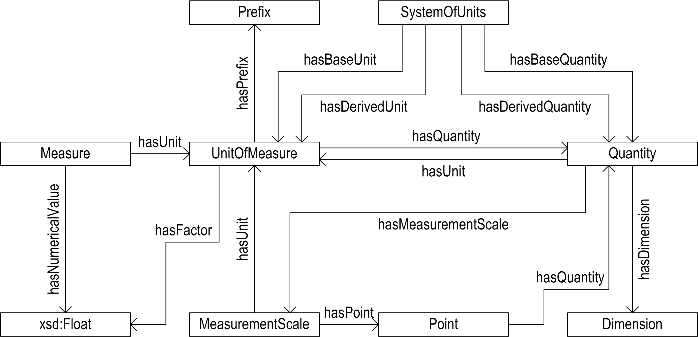

# OM - Ontology of units of Measure

The **Ontology of units of Measure (OM) 2.0** models concepts and relations important to scientific research. It has a strong focus on units, quantities, measurements, and dimensions.
OM is modelled in [OWL 2 - Web Ontology Language](https://www.w3.org/TR/owl2-overview/).

**Base URI:** `http://www.ontology-of-units-of-measure.org/resource/om-2/`

**Namespace Prefix:** `om`

The OM ontology provides classes, instances, and properties that represent the different concepts used for defining and using measures and units. It includes, for instance, common units such as the SI units metre (`om:metre`) and kilogram (`om:kilogram`), but also units from other systems of units such as the mile (`om:mile`) or nautical mile (`om:nauticalMile-International`). For many application areas it includes more specific units and quantities, such as the unit of the Hubble constant: km/s/Mpc `om:kilometrePerSecond-TimePerMegaparsec`, or the quantity vaselife `om:VaseLife`.

The following *application areas* are supported by OM:

* Geometry
* Mechanics
* Thermodynamics
* Electromagnetism
* Fluid mechanics
* Chemical physics
* Photometry
* Radiometry and Radiobiology
* Nuclear physics
* Astronomy and Astrophysics
* Cosmology
* Earth science
* Meteorology
* Material science
* Microbiology
* Economics
* Information technology
* Typography
* Shipping
* Food engineering
* Post-harvest technology
* Dynamics of texture and taste
* Packaging

**Figure 1.** The UML diagram below shows the class structure of the OM ontology.

To express, for instance, the temperature at [Alert, Canada](https://en.wikipedia.org/wiki/Alert,_Nunavut) on November 30th, 2016 at 11:28 AM, we have the following triples:
	
	_:bn1 rdf:type om:Point ;
		   om:hasScale om:CelsiusScale ;
		   om:hasNumericalValue "-24.11"^^xsd:double ; 
		   weather:hasDate "2016-11-30T11:27:59:000+01:00"^^xsd:dateTime .
	_:bn2 om:hasValue _:bn1 .
	_:bn2 rdf:type om:ThermodynamicTemperature .
	_:bn2 om:hasPhenomenon _:bn3 .
	<http://sws.geonames.org/6295922/> weather:hasWeather _:bn3 ;
		   gn:name "Alert" .
	
where `weather` and `gn` are prefixes for other namespaces (`gn` for the [geonames](http://www.geonames.org) namespace). 

> In OM, scales, such as the temperature scale are handled differently than their corresponding units. For instance a temperature difference will be expresses as a measure with a unit such as °C or K, where 28°C = 28 K. On the other hand an absolute temperature of 28°C is being referred to the **Celsius scale** and is equal to 301 K. Usually, the scale is used.
 
OM is based on several official paper standards, such as: [The Guide for the Use of the International System of Units](http://physics.nist.gov/cuu/pdf/sp811.pdf), by the NIST. 

### Software

Several software packages support the use, or make use of, OM:

* [`om-java-libs`](https://github.com/dieudonne-willems/om-java-libs): A software library written in Java that uses OM to convert between units.

### Previous versions

Previous versions were published on the wurvoc platform.

* OM 1.8: [http://www.wurvoc.org/vocabularies/om-1.8/](http://www.wurvoc.org/vocabularies/om-1.8/)

### Papers on OM
   
1. H. Rijgersberg, M.L.I. Wigham, J.L. Top, “How semantics can improve engineering processes. A case of units of measure and quantities.” *Advanced Engineering Informatics*, **25**, 2, 2011, pp. 276-287.
2.  H. Rijgersberg, M.F.J. van Assem, J.L. Top, “Ontology of Units of Measure and Related Concepts.” *Semantic Web*, **4**, 1, 2013, pp. 3-13.
3.  D.J.M. Willems, H. Rijgersberg, J.L. Top, “Identifying and extracting quantitative data in annotated text”, *Proceedings of the Workshop on Semantic Web and Information Extraction (SWAIE 2012)*, Galway, Ireland, 2012, pp. 43-54.
