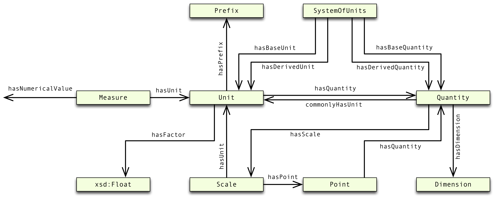

# OM – Ontology of units of Measure

*Ontologie d'unités de Mesures* &ensp; Ontologie der Maßeinheiten &ensp; *Ontologie van Maateenheden* &ensp; 測定単位のオントロジ
    
The **Ontology of units of Measure (OM) 2.0** models concepts and relations that underlie the formulation of quantitative knowledge in scientific research. It has a strong focus on units, quantities, measures, and dimensions. OM is modelled in [OWL 2 (Web Ontology Language)](https://www.w3.org/TR/owl2-overview/). The ontology can be found in [om-2.0.rdf](https://github.com/HajoRijgersberg/OM/blob/master/om-2.0.rdf), and links to UCUM (the Unified Code for Units of Measure) are in [om-2-ucum.ttl](https://github.com/HajoRijgersberg/OM/blob/master/om-2-ucum.ttl).

**Base URI:** `http://www.ontology-of-units-of-measure.org/resource/om-2/`

**Namespace Prefix:** `om`
<br/><br/>


<br/><br/>

<br/><br/>

## Overview

* [Ontology of units of Measure (OM)](#om)
* [RecordTable ontology](#recordtable)
* [Software](#software)
* [Previous versions](#previous-versions)
* [Acknowledgements](#acknowledgements)
* [Literature](#literature)
<br/><br/>

## <a name="om"></a>Ontology of units of Measure (OM)

The OM ontology provides classes, instances, and properties that represent the different concepts used for defining and using measures and units. It includes, for instance, common units such as the SI units metre (`om:metre`) and kilogram (`om:kilogram`), but also units from other systems of units such as the mile (`om:mile`) or nautical mile (`om:nauticalMile-International`). For many application areas it includes more specific units and quantities, such as the unit of the Hubble constant: km/s/Mpc `om:kilometrePerSecond-TimePerMegaparsec`, or the quantity vaselife `om:VaseLife`.

The following *application areas* are supported by OM:

* Geometry
* Mechanics
* Thermodynamics
* Electromagnetism
* Fluid mechanics
* Chemical physics
* Photometry
* Radiometry and Radiobiology
* Nuclear physics
* Astronomy and Astrophysics
* Cosmology
* Earth science
* Meteorology
* Material science
* Microbiology
* Economics
* Information technology
* Typography
* Shipping
* Food engineering
* Post-harvest technology
* Dynamics of texture and taste
* Packaging



**Figure 1.** The UML diagram below shows the class structure of the OM ontology. **Correction:** the range of hasNumericalValue is not xsd:float, as indicated in the figure, but is left open to accomodate any datatype required in one's application of OM.

The following triples express, for example, the diameter of an apple:

```turtle
ex:_10Centimetres rdf:type om:Measure ;
  om:hasNumericalValue "10"^^xsd:double ;
  om:hasUnit om:centimeter .
ex:diameterOfApple1 om:hasValue ex:_10Centimetres ;
  a om:Diameter ;
  om:hasPhenomenon ex:apple1 .
ex:apple1 rdf:type ex:Apple .
```

where `ex` is a prefix to another namespace.

The RDF structure for this example shows as follows:


**Figure 2.** An RDF diagram representing the size of an apple as 10 cm. (The arrow for property om:hasNumericalValue should be reversed.)

Please note that:

> In OM, scales, such as the temperature scale are handled differently than their corresponding units. For instance a temperature difference will be expressed as a measure with a unit such as °C or K, where 28°C = 28 K. On the other hand an absolute temperature of 28°C is being referred to the **Celsius scale** and is equal to 301 K. Usually, the scale is used. [Here is an example of using a temperature scale.](Weather-example.md)

OM is based on several official paper standards, such as: [The Guide for the Use of the International System of Units](http://physics.nist.gov/cuu/pdf/sp811.pdf), by the NIST. 
<br/><br/>

## <a name="recordtable"></a>RecordTable Ontology

Included in the OM repository is the [RecordTable](https://github.com/HajoRijgersberg/OM/blob/master/record_table.ttl) vocabulary for semantically modelling tabular data, as a supplement to the existing RDF Data Cube standard. RDF Record Table has a nested structure of records that contain self-describing observations, and is able to cope with irregular, missing and unexpected data. This allows it to escape the constraints of RDF Data Cube and to model complex data, such as that occurring in science and engineering.

As an example, consider the following Table 1. and Figure 3.


**Table 1.** An example table, parts of which are depicted as a RecordTable graph in Figure 3. The highlighted cells are depicted in the graph.


**Figure 3.** An RDF diagram representing an example using RecordTable.
<br/><br/>

## <a name="software"></a>Libs

Several libs support the use of OM:

* [`om-java-libs`](https://github.com/dieudonne-willems/om-java-libs): A software library written in Java that uses OM to convert between units.
* [`om-python-libs`](https://github.com/lapsedPacifist/OMLib/tree/feature/rdf): Same in Python.
<br/><br/>

## <a name="previous-versions"></a>Previous versions

Previous versions were published on the wurvoc platform.

* OM 1.8: [http://www.wurvoc.org/vocabularies/om-1.8/](http://www.wurvoc.org/vocabularies/om-1.8/)
<br/><br/>

## <a name="acknowledgements"></a>Acknowledgements

OM was developed during the Virtual Laboratory for e-Science and COMMIT projects. We would like to thank Jan Martin Keil and Sirko Schindler of the University of Jena for reviewing OM (see [Unit Ontology Review](https://github.com/fusion-jena/unit-ontology-review) and [publication](http://www.semantic-web-journal.net/system/files/swj1825.pdf)).


<br/><br/>

## <a name="literature"></a>Literature

### <a name="literature-on-om"></a>On OM

1. H. Rijgersberg, M.L.I. Wigham, J.L. Top, “How semantics can improve engineering processes. A case of units of measure and quantities.” *Advanced Engineering Informatics*, **25**, 2, 2011, pp. 276-287, https://doi.org/10.1016/j.aei.2010.07.008.
2. H. Rijgersberg, M.F.J. van Assem, J.L. Top, “Ontology of Units of Measure and Related Concepts.” *Semantic Web*, **4**, 1, 2013, pp. 3-13, https://doi.org/10.3233/SW-2012-0069.
3. Top, J., Wigham, M., Rijgersberg, H. “Semantically Enriched Spreadsheet Tables in Science and Engineering.” *SEMAPRO 2014*.
4. Mari Wigham, Hajo Rijgersberg, Martine de Vos, Jan Top. “Semantic Support for Tables using RDF Record Table.” *International Journal On Advances in Intelligent Systems*, **8** (1 and 2), 2015, 128-144.
6. Hajo Rijgersberg, Semantic support for quantitative research, PhD thesis, Vrije Universiteit Amsterdam, 2013.

### <a name="comparison-with-other-unit-ontologies"></a>Comparison of OM with other unit ontologies

1. Jan Martin Keil, Sirko Schindler, “Comparison and Evaluation of Ontologies for Units of Measurement.” *Semantic Web*, **1**, 2018, pp. 1-19.
2. Do C., Pauwels E.J. (2013) Using MathML to Represent Units of Measurement for Improved Ontology Alignment. In: Carette J., Aspinall D., Lange C., Sojka P., Windsteiger W. (eds) Intelligent Computer Mathematics. CICM 2013. Lecture Notes in Computer Science, vol 7961. Springer, Berlin, Heidelberg.
3. Markus D. Steinberg, Sirko Schindler, Jan Martin Keil, Use Cases and Suitability Metrics for Unit Ontologies.
4. Keil, Jan Martin (2020). ABECTO: An ABox Evaluation and Comparison Tool for Ontologies. In: ESWC 2020 Satellite Events: Posters and Demos. DOI:10.1007/978-3-030-62327-2_24.
5. Xiaoming Zhang, Kai Li, Chongchong Zhao, Dongyu Pan, "A survey on units ontologies: architecture, comparison and reuse." *Program*, Vol. 51 No. 2, 2017, pp. 193-213, https://www.emerald.com/insight/content/doi/10.1108/PROG-08-2015-0056/full/html.

### <a name="uses-of-om"></a>Best practices (uses) of OM (not exhaustive and under construction) 

1. D.J.M. Willems, H. Rijgersberg, J.L. Top, “Identifying and extracting quantitative data in annotated text”, *Proceedings of the Workshop on Semantic Web and Information Extraction (SWAIE 2012)*, Galway, Ireland, 2012, pp. 43-54.
2. Martine de Vos, Jan Wielemaker, Hajo Rijgersberg, Guus Schreiber, Bob Wielinga, Jan Top. Combining Information on Structure and Content to Automatically Annotate Scientific Spreadsheet Tables. *Int. J. Human-Computer Studies*, 103, 2017, pp. 63-76.
3. Bonsai, “BONSAI – Big Open Network for Sustainability Assessment Information.” 2019, https://bonsai.uno/.
4. Thorben Iggena, Daniel Kümper, Ralf Tönjes, Martin Strohbach, Pavel Smirnov, Juan A. Martinez, Sahr Thomas Acton, Roonak Rezvani, Josiane Parreira, “IoTCrawler. D4.1 IoT Data Attributes and Quality of Information.” University of Applied Sciences Osnabrück, 2019, https://iotcrawler.eu/wp-content/uploads/2019/07/D4.1_final.pdf.
5. Gkotse B., Jouvelot P., Ravotti F. (2019) IEDM: An Ontology for Irradiation Experiments Data Management. In: Hitzler P. et al. (eds) The Semantic Web: ESWC 2019 Satellite Events. ESWC 2019. Lecture Notes in Computer Science, **11762**, Springer, Cham, 2019.
6. Berrahou, S., Buche, P., Dibie-Barthelemy, J. , Roche, M., How to Extract Unit of Measure in Scientific Documents? In Proceedings of the International Conference on Knowledge Discovery and Information Retrieval and the International Conference on Knowledge Management and Information Sharing (SSTM-2013), 2013, pp. 249-256.
7. Mark S. Fox, A Foundation Ontology for Global City Indicators, University of Toronto, 2015.
8. Megan Katsumi, The Ontology of Units of Measure, https://enterpriseintegrationlab.github.io/icity/OM/doc/index-en.html.
9. Do C., Pauwels E.J. (2013) Harnessing Mathematics for Improved Ontology Alignment. In: Augusto J.C., Wichert R., Collier R., Keyson D., Salah A.A., Tan AH. (eds) Ambient Intelligence. AmI 2013. Lecture Notes in Computer Science, vol 8309. Springer, Cham.
10. Stocker M. et al. (2013) Acquisition and Representation of Knowledge for Atmospheric New Particle Formation. In: Hřebíček J., Schimak G., Kubásek M., Rizzoli A.E. (eds) Environmental Software Systems. Fostering Information Sharing. ISESS 2013. IFIP Advances in Information and Communication Technology, vol 413. Springer, Berlin, Heidelberg.
11. Soroush Samadian, Constructing and applying semantic models of clinical phenotypes to support web-embedded clinical research, PhD thesis, University of British Columbia, 2013.
12. Aurélie Thébaut, Thibault Scholash, Brigitte Charnomordic, Nadine Hilgert, Combining a sensor software with statistical analysis for modeling vine water deficit impact on grape quality, 2014.
13. Valueflows, A vocabulary for the distributed economic networks of the next economy, https://valueflo.ws/.
14. Valentina Tamma, Mauro Dragoni, Rafael Gonçalves, Agnieszka Ławrynowicz (Eds.), Ontology Engineering: 12th International Experiences and Directions Workshop on OWL, OWLED 2015, co-located with ISWC 2015, Bethlehem, PA, USA, 2015.
15. Soroush Samadian, Bruce McManus, Mark Wilkinson, Automatic detection and resolution of measurement-unit conflicts in aggregated data, BMC Med Genomics, 7 (Suppl 1), 2014. 
16. Biodiversity Information Standards TDWG, https://terms.tdwg.org/wiki/Main_Page.
17. Maxime Lefrançois, Assisting the Semanticization of data with Vocabularies, Languages, and Tools.
18. Filip Radulovic, Raúl García-Castro, The Evaluation Result Ontology, 2015, http://vocab.linkeddata.es/eval/index.html.
19. Megan Katsumi, Mark Fox, iCity Ontology Initial Release, University of Toronto, 2017.
20. Paola Espinoza-Arias, María Poveda-Villalón, Raúl García-Castro, Oscar Corcho, Ontological Representation of Smart City Data: From Devices to Cities, Appl. Sci. 9, 32, 2019.
21. Bhoomin Pandya, Units of Measurement Ontology Added to LOV, 2020, https://medium.com/@conceptminers/units-of-measurement-of-ontology-added-to-lov-21c7efc92a62.
22. A. P. Vedurmudi, M. Gruber, S. Eichstädt and A. Paschke, "Semantics in Sensor Networks: An Ontology for Dynamic Transfer Behavior in Calibrated Sensors," 2021 IEEE International Workshop on Metrology for Industry 4.0 & IoT (MetroInd4.0&IoT), 2021, pp. 358-363, doi: 10.1109/MetroInd4.0IoT51437.2021.9488554. https://ieeexplore.ieee.org/document/9488554.
23. B. D. Hall, M. Kuster, Representing quantities and units in digital systems, submitted to Measurement: Sensors, 2022.
24. Agneta Ghose, Matteo Lissandrini, Emil Riis Hansen, Bo Pedersen Weidema, A core ontology for modeling life cycle sustainability assessment on the Semantic Web, Journal of Industrial Ecology, 26, 2022, 731–747.

### <a name="references-to-om"></a>Discussing OM in general (not exhaustive and under construction)

1. Loli Burgueño, Tanja Mayerhofer, Manuel Wimmer, Antonio Vallecillo, “Specifying quantities in software models.” *Information and Software Technology*, **113**, 2019, pp. 82-97.
2. Lavdim Halilaj, An Approach for Collaborative Ontology Development in Distributed and Heterogeneous Environments, PhD thesis, University of Bonn, 2019.
3. Fredrik Heintz, Daniel de Leng, Semantic Information Integration with Transformations for Stream Reasoning.
4. Georgios V. Gkoutos, Paul N. Schofield, Robert Hoehndorf, “The Units Ontology: a tool for integrating units of measurement in science”, Database, 2012.
5. Gianluca Quercini, Chantal Reynaud, Entity Discovery and Annotation in Tables, EDBT/ICDT ’13, Genoa, Italy, 2013.
6. Isabel F. Cruz, Venkat R. Ganesh, Seyed Iman Mirrezaei, Semantic extraction of geographic data from web tables for big data integration, Proceedings of the 7th Workshop on Geographic Information Retrieval, Orlando, Florida, 2013, pp. 19-26.
7. Damion M. Dooley, William W.L Hsiao, Emma Griffiths, “An OBI ontology Datum Proof Sheet. Toward a harmonized treatment of categorical and scalar data entities in user interfaces”.
8. David Flater, Architecture for Software-Assisted Quantity Calculus, NIST Technical Note 1943, 2016.
9. Alexei V. Samsonovich (Ed.), Biologically Inspired Cognitive Architectures 2019, Proceedings of the Tenth Annual Meeting of the BICA Society, 2019.
10. Vladimir Cvjetkovic, Web physics ontology: Online interactive symbolic computation in physics, 2017 4th Experiment@International Conference (exp.at'17), 2017.
11. Mauro Dragoni, María Poveda-Villalón, Ernesto Jimenez-Ruiz (Eds.), OWL: Experiences and Directions – Reasoner Evaluation: 13th International Workshop, OWLED 2016, and 5th Internation Workshop, ORE 2016, Bologna, Italy, 2016.
12. Jacques Carette, David Aspinall, Christoph Lange, Petr Sojka, Wolfgang Windsteiger (Eds.), Intelligent Computer Mathematics: MKM, Calculemus, DML, and Systems and Projects 2013, Held as Part of CICM 2013, Bath, UK, 2013.
13. Cvetana Krstev, Staša Vujičić Stanković, Duško Vitas, Approximate Measures in the Culinary Domain: Ontology and Lexical Resources, 9th Language Technologies Conference, Information Society, 2014.
14. J.S. Schwarz, S. Lehnhoff, Ontology-Based Development of Smart Grid Co-Simulation Scenarios, EKAW, 2018.
15. Marco Balduini, Emanuele Della Valle, FraPPE: a vocabulary to represent heterogeneous spatio-temporal data to support visual analytics, ISWC, 2015.
